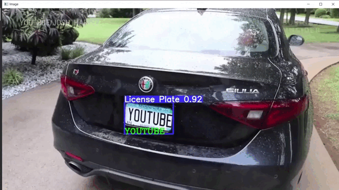
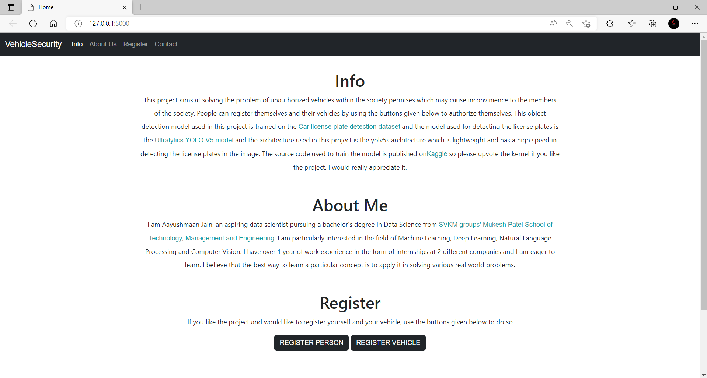
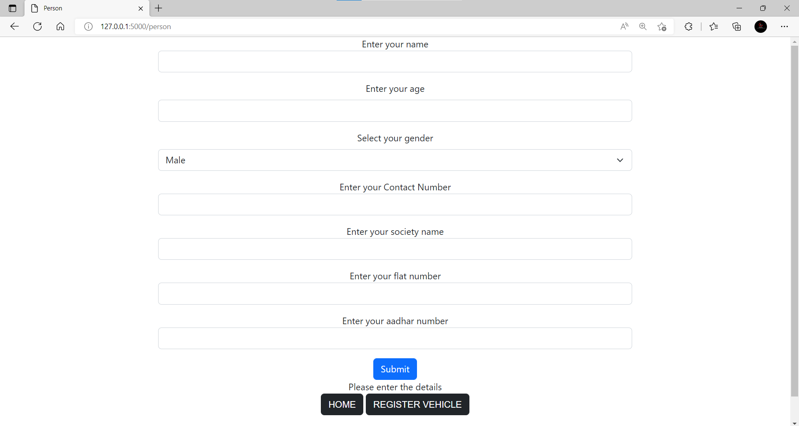
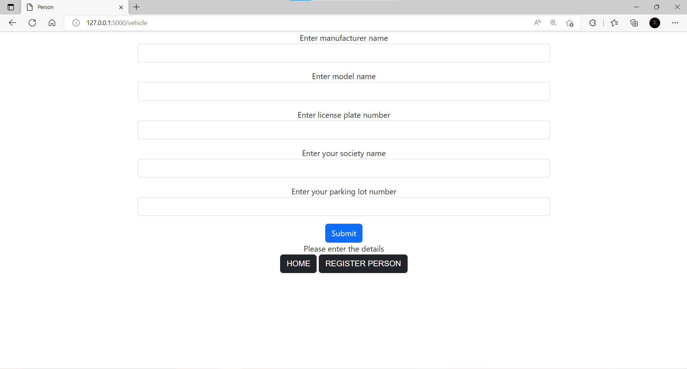

# Vehicle_Security

This project aims to track unauthorized vehicles entering a society from the CCTV camera footages using <a href="https://github.com/ultralytics/yolov5">YOLO-V5 model</a> to detect the license plates. The model was trained on <a href="https://www.kaggle.com/datasets/andrewmvd/car-plate-detection">Car plate detection</a> dataset. Then the license plate numbers were read from the license plates using <a href="https://github.com/JaidedAI/EasyOCR">EasyOCR</a> and they were entered in the database 

Authorized residents and vehicles can be registered by using the UI made on the flask app 

# Setup and usage 

1. Clone the github repository
```
git clone https://github.com/aayush1036/vehicle-security.git
```

2. Create virtual environment
```
virtualenv env 
# For linux 
source env/bin/activate
# For windows 
env\Scripts\activate
```

3. Install the required dependencies 
```
pip install -r requirements.txt
```

4. Edit the config file to suit your database credentials

5. Start the detections by using the ```detect.py``` script on sample video or your CCTV/webcam
```
# For detecting on sample video
python detect.py --society YOUR_SOCIETY_NAME --position ENTRY/EXIT --path sample.mp4
# For detecting on CCTV/Webcam
python detect.py --society YOUR_SOCIETY_NAME --position ENTRY/EXIT --device 0/1/2....
```

6. If you want to retrain the model on custom data, please refer to the kaggle notebook published on <a href="https://www.kaggle.com/code/aayusmaanjain/license-plate-detection/">License plate detection notebook</a> by me and please upvote it and comment on it if you liked it

# Demo 


# User Interface 
1. Home page <br>

1. To register person <br>

2. To register vehicle <br>


# Future prospects 
1. Improve OCR 
2. Make predictions more faster